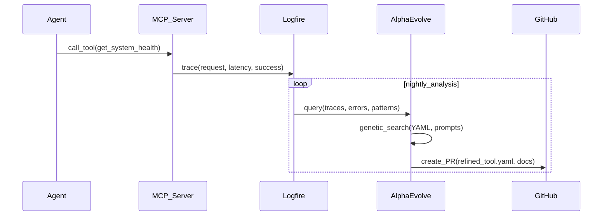

# COS Phase 2: Agentic Substrate & MCP Integration Blueprint v1.0

**Document Type**: Strategic Architecture Overview (30,000-foot view)
**Version**: 1.1 (Updated June 8, 2025)
**Date**: June 6, 2025
**Lead Visionary**: Kevin
**Status**: Living Document - Updated Throughout Phase 2

---

## Mandate

> **All new code and tests must be developed to **nearly 100% test coverage** from day one. Coverage must never decrease overall—each sprint must demonstrate a measurable, rapid coverage increase as we re-enable skipped tests.**

---

## Coverage Progression Strategy

**Current State**: Phase 1 completion at 30% coverage (570+ tests systematically skipped)
**Phase 2 Goal**: Reach 97% coverage through systematic re-enablement + new code
**Ongoing Standard**: 97%+ coverage maintained permanently

### Sprint-Based Coverage Targets:
- **Sprint 2.1** (Database Foundation): 45% → Re-enable P2-ASYNC-001, P2-SCHEMA-001, P2-MODELS-001
- **Sprint 2.2** (Application Layer): 65% → Re-enable P2-MEM0-001, P2-ROUTER-001, P2-SERVICE-001
- **Sprint 2.3** (Graph Layer): 80% → Re-enable P2-GRAPH-001
- **Sprint 2.4** (Integration): 97% → Re-enable P2-INTEGRATION-001
- **Phase 2 Completion**: Lock CI at 97% permanently

**Reference**: See `docs/PHASE_2_TECHNICAL_DEBT.md` for complete re-enablement roadmap

---

## Executive Vision

**Phase 2 Mission**: Transform the `cc` (Control Center) module into **v1.0: The Gold-Standard Agentic Substrate** - a fully self-improving, memory-layered, agent-ready foundation that will serve as the immutable DNA for all future COS modules.

**The End State**: A system where LLM agents have standardized, powerful interfaces (MCP) to access and manipulate the entirety of Kevin's structured knowledge base, enabling the creation of "20 best versions of myself" that can synthesize and generate with unparalleled depth and coherence.

---

## Phase 2 Capabilities Stack

```
Phase-2 Capabilities Stack
 ├─ L1  Postgres  (mem0_<module>)   – raw prompt / event logs
 ├─ Redis Pub/Sub                  – publishes "mem0.recorded.<module>"
 ├─ L2  Neo4j Graph  (mem0g)       – transforms L1 → semantic nodes/edges
 ├─ MCP Server  (/mcp/capabilities)– exposes high-level TOOLS & RESOURCES to LLM agents
 ├─ Logfire Tracing                – spans across API → DB → Redis → Graph
 └─ AlphaEvolve Side-car           – watches traces, refines MCP YAML, suggests new tools
```

### Architecture Philosophy

**Dual-Layer Interface Strategy**:
- **OpenAPI Layer**: Low-level contract (routes, schemas, CRUD operations) for direct programmatic access
- **MCP Layer**: High-level agent contract (create_task, process_queue, read_resource, etc.) for LLM agent interaction

**MCP = "USB-C for AI"**:
- Standardized JSON-RPC 2.0 messages over stdio or HTTP-SSE
- TOOLS (executes actions) & RESOURCES (data blobs/streams) are first-class citizens
- Each module runs an MCP server; IDEs/agents host the MCP client
- Security: local stdio for dev, TLS + auth for remote deployment

---

## Memory Layer Architecture

### L1: Postgres (`mem0_<module>`) - Raw Event Storage
**Purpose**: Capture every prompt, event, and interaction in structured form
- Raw prompt/response pairs
- Event traces with full context
- Timestamped interaction logs
- Module-specific scratch data with TTL management

### L1.5: Redis Pub/Sub - Real-Time Event Distribution
**Purpose**: Immediate event propagation across the system
- Publishes `mem0.recorded.<module>` events
- Cross-module communication backbone
- Real-time notification system
- Event-driven architecture foundation

### L2: Neo4j Graph (`mem0g`) - Semantic Memory
**Purpose**: Transform raw events into semantic relationships
- Entities, concepts, and their interconnections
- Knowledge graph emergence from interaction patterns
- Contextual memory retrieval
- Relationship-based insight generation

### L3: Zettelkasten Layer (Future)
**Purpose**: Curated, long-term knowledge architecture
- Distilled insights from L1/L2 processing
- Human-curated knowledge nodes
- Cross-reference and citation networks
- Publication-ready knowledge structures

### L4: PostgreSQL JSON/JSONB (Truth Store)
**Purpose**: Canonical truth storage with document flexibility
- Source of record for all system state
- Optimized JSON document storage
- Performance-critical data persistence
- Audit trail and historical state

---

## MCP (Model Context Protocol) Integration

### Core MCP Components

#### Tools (Action Layer)
High-level operations exposed to LLM agents:
```yaml
# Example: cc/mcp/tools/get_system_health.yaml
name: get_system_health
description: "Retrieve comprehensive system health across all modules"
parameters:
  include_traces:
    type: boolean
    description: "Include recent Logfire trace summaries"
  time_window:
    type: string
    description: "Time window for health data (1h, 24h, 7d)"
    default: "1h"
```

#### Resources (Data Layer)
Structured data access for agents:
```yaml
# Example: cc/mcp/resources/module_config.yaml
name: module_config
uri: "config://cc/current"
description: "Live configuration state for CC module"
mime_type: "application/json"
access_pattern: "read-only"
```

#### Prompts (Guidance Layer)
Optimized interaction templates:
```yaml
# Example: cc/mcp/prompts/system_diagnostic.yaml
name: system_diagnostic
description: "Guide agent through comprehensive system analysis"
template: |
  You are analyzing the COS system health. Use these steps:
  1. Call get_system_health(include_traces=true)
  2. Check module_config resource for any misconfigurations
  3. Identify top 3 optimization opportunities
```

### MCP Server Architecture

Each module implements:
```
backend/<module>/mcp/
├── server.py              # MCP server implementation
├── client.py              # Inter-module MCP communication
├── tools/                 # Tool implementations
│   ├── __init__.py
│   ├── health_tools.py
│   ├── module_tools.py
│   └── coordination_tools.py
├── resources/             # Resource handlers
│   ├── __init__.py
│   ├── config_resource.py
│   └── status_resource.py
└── prompts/              # Agent guidance prompts
    ├── __init__.py
    ├── system_prompts.py
    └── diagnostic_prompts.py
```

---

## AlphaEvolve Feedback Loop

### Self-Improvement Mechanism



### Evolution Targets
1. **Tool Descriptor Refinement**: Improve parameter clarity, descriptions, examples
2. **New Tool Discovery**: Identify common multi-step patterns for composite tools
3. **Prompt Template Optimization**: Enhance agent guidance based on success patterns
4. **Resource Access Patterns**: Optimize data retrieval based on usage analytics

---

## 6-Sprint Execution Roadmap

| Sprint | Focus | Key Deliverables | Definition of Done |
|--------|-------|------------------|-------------------|
| **Sprint 1** | Logfire + L1 mem0 | `common/logger_logfire.py`, `mem0_models.py`, Alembic migrations | Logfire spans show DB inserts; coverage ≥ 97% |
| **Sprint 2** | Redis Eventing | `common/pubsub.py`, publish `mem0.recorded.cc` | Redis message visible in integration test |
| **Sprint 3** | Neo4j Bridge | `mem0_consumer.py`, `graph_models.py` | L1 events become Neo4j nodes; trace spans green |
| **Sprint 4** | MCP Server | `/mcp/capabilities`, YAML tools, CI drift-checker | Agent can call `get_system_health`; spec validated |
| **Sprint 5** | Generator v2 | Enhanced `generate_module.py` | New module boots & passes tests in < 45s |
| **Sprint 6** | AlphaEvolve PoC | `Dockerfile.alphaevolve`, nightly GitHub Action | PR created & reviewed; safety gate passes |

### Sprint Integration with Technical Debt Resolution

Each sprint includes **systematic test re-enablement** alongside new development:

**Sprint 2.1: Database Foundation**
- Implement: MCP Tools + L1 Memory Layer
- **Re-enable**: P2-ASYNC-001, P2-SCHEMA-001, P2-MODELS-001 (~105 tests)
- **Coverage Jump**: 30% → 45%

**Sprint 2.2: Application Layer**
- Implement: MCP Resources + Service Layer
- **Re-enable**: P2-MEM0-001, P2-ROUTER-001, P2-SERVICE-001 (~150 tests)
- **Coverage Jump**: 45% → 65%

**Sprint 2.3: Graph Layer**
- Implement: L2 Neo4j Integration
- **Re-enable**: P2-GRAPH-001 (~40 tests)
- **Coverage Jump**: 65% → 80%

**Sprint 2.4: Integration & Polish**
- Implement: Full Stack Integration
- **Re-enable**: P2-INTEGRATION-001 (~70 tests)
- **Coverage Jump**: 80% → 97%

### Sprint Details

#### Sprint 1: Foundational Observability & L1 Memory
**Core Deliverables**:
- Logfire integration across all cc module operations
- `mem0_cc` schema with comprehensive event logging
- Alembic migrations for L1 data structures
- Initial MCP metadata placeholder (`cc_meta.yaml`)

**Success Criteria**:
- Every API call generates Logfire spans
- All events stored in `mem0_cc` with proper indexing
- 97%+ test coverage maintained
- Zero technical debt introduction

#### Sprint 2: Redis Pub/Sub Event Architecture
**Core Deliverables**:
- Redis pub/sub client implementation (`common/pubsub.py`)
- Event publishing on all L1 memory operations
- Cross-module event subscription framework
- Integration testing for event flow

**Success Criteria**:
- `mem0.recorded.cc` events published on every L1 write
- Other modules can subscribe to cc events
- Event delivery guaranteed with Redis persistence
- Pub/sub operations traced in Logfire

#### Sprint 3: L2 Graph Bridge - Semantic Memory
**Core Deliverables**:
- L1→L2 consumer service (`mem0_consumer.py`)
- Neo4j graph models for cc domain (`graph_models.py`)
- Semantic transformation logic
- Graph relationship establishment

**Success Criteria**:
- L1 events automatically create Neo4j nodes/relationships
- Graph queries return meaningful semantic connections
- Consumer service handles event replay and error recovery
- Full L1→L2 pipeline traced end-to-end

#### Sprint 4: MCP Server Implementation
**Core Deliverables**:
- Full MCP server infrastructure (`cc/mcp/server.py`)
- 2-3 core MCP tools (health, configuration, module management)
- MCP resource definitions for cc data
- CI validation for MCP compliance

**Success Criteria**:
- LLM agents can discover and invoke cc MCP tools
- All MCP interactions logged in Logfire
- MCP tools map correctly to underlying OpenAPI services
- Documentation auto-generated from YAML descriptors

#### Sprint 5: Module Generation Enhancement
**Core Deliverables**:
- `generate_module.py v2.0` with MCP scaffolding
- Template parameterization for all layers (L1, L2, MCP)
- CI drift detection between OpenAPI and MCP capabilities
- Full module lifecycle automation

**Success Criteria**:
- Generated modules include functional MCP servers
- All naming conventions properly parameterized
- New modules achieve 97% test coverage out-of-box
- Module generation time < 45 seconds

#### Sprint 6: AlphaEvolve Integration
**Core Deliverables**:
- AlphaEvolve Docker container (`Dockerfile.alphaevolve`)
- Logfire→AlphaEvolve data pipeline
- MCP YAML refinement algorithms
- Automated PR generation workflow

**Success Criteria**:
- AlphaEvolve generates valid MCP YAML improvements
- Nightly analysis runs automatically via GitHub Actions
- Safety gates prevent invalid or malicious changes
- Human review workflow for AI-generated improvements

---

## Long-Term Vision Realization

### Morning Voice Record → Deep Work → Classics Pipeline

#### 1. **Voice Ingestion** (Morning Routine)
```python
# Agent interaction via MCP
voice_data = transcribe_voice_recording("morning_walk_20250106.wav")
ingestion_result = IngestionModule.mcp_call(
    tool="ingest_raw_text",
    params={
        "text": voice_data,
        "source_uri": "voice://2025-01-06/morning_walk",
        "tags": ["morning", "walking", "voice_memo"],
        "auto_categorize": True
    }
)
```

#### 2. **Deep Work Sessions** (Agentic Collaboration)
```python
# Cursor (as MCP Host) orchestrates cross-module queries
outline_request = "Draft outline for 'Autopoiesis in Creative Systems' chapter"

# Multi-module MCP orchestration:
zk_results = ZKManagerModule.mcp_call(
    tool="query_zk",
    params={
        "tags": ["autopoiesis"],
        "content_filter": "feedback loops",
        "date_filter": "last_3_months"
    }
)

voice_results = VoiceMemoModule.mcp_call(
    tool="search_voice_memos",
    params={
        "keywords": ["feedback loops"],
        "date_range": "last_3_months"
    }
)

# Synthesis by LLM agent using structured MCP results
outline = synthesize_chapter_outline(zk_results, voice_results, outline_request)
```

#### 3. **Classic Generation** (Multi-Century Output)
- LLM agents access complete knowledge graph via standardized MCP interfaces
- No context window limitations - precise queries for exactly needed information
- Synthesis across all memory layers (L1→L4) for unprecedented depth
- Output quality approaches "20 best versions of Kevin" collaborating

### System Evolution Properties

#### Self-Improving Agent Interfaces
- **Usage Pattern Recognition**: AlphaEvolve identifies common multi-step agent workflows
- **Tool Composition**: Automatic suggestion of composite MCP tools for frequent patterns
- **Clarity Enhancement**: Continuous refinement of tool descriptions based on agent success rates
- **Performance Optimization**: Resource access pattern optimization based on Logfire analytics

#### Knowledge Graph Emergence
- **Semantic Relationship Discovery**: L2 graph automatically identifies concept connections
- **Cross-Domain Insights**: Unexpected connections between disparate knowledge areas
- **Temporal Pattern Recognition**: Evolution of ideas and concepts over time
- **Collaborative Intelligence**: Multiple agent perspectives enriching the knowledge base

#### Multi-Century Durability
- **Technology Independence**: MCP provides abstraction layer above specific implementations
- **Graceful Evolution**: System can evolve components while maintaining agent compatibility
- **Knowledge Preservation**: Multiple redundant storage layers ensure no data loss
- **Extensible Architecture**: New modules integrate seamlessly via established patterns

---

## Success Metrics & KPIs

### Phase 2 Completion Criteria

#### Technical Excellence
- ✅ **97%+ Test Coverage** across all new components
- ✅ **Zero Technical Debt** introduction
- ✅ **Sub-300ms P95** API response times maintained
- ✅ **MCP Compliance** validated via automated testing

#### Functional Capabilities
- ✅ **L1→L2 Pipeline** processes 100% of events without data loss
- ✅ **MCP Tools** accessible and functional for LLM agents
- ✅ **Cross-Module Communication** via Redis pub/sub working
- ✅ **AlphaEvolve Integration** generating valid improvements

#### Agent Experience
- ✅ **Tool Discovery** automatic via MCP capabilities endpoint
- ✅ **Resource Access** performant and reliable
- ✅ **Error Handling** graceful with clear agent feedback
- ✅ **Documentation** auto-generated and comprehensive

### Long-Term Vision Validation

#### Knowledge System Effectiveness
- **Query Success Rate**: >95% of agent queries return relevant results
- **Cross-Reference Accuracy**: >90% of semantic connections verified as meaningful
- **Synthesis Quality**: Generated content maintains Kevin's voice and depth
- **System Learning**: Measurable improvement in agent effectiveness over time

#### Operational Excellence
- **Uptime**: >99.9% availability for all MCP services
- **Data Integrity**: Zero data corruption across all memory layers
- **Performance**: Linear scaling with knowledge base growth
- **Evolution Safety**: 100% of AlphaEvolve suggestions pass safety gates

---

## CI Configuration Evolution

**Phase 1**: `--cov-fail-under=30` (enables merge with systematic skips)
**Phase 2 Progression**: Bump CI threshold each sprint as coverage increases
**Phase 2 Completion**: `--cov-fail-under=97` (permanent high standard)

Why This Works:

1. Clear Integration: Links technical debt resolution to sprint delivery
2. Measurable Progress: Specific coverage targets per sprint
3. Quality Mandate: New code must be 95-100% covered
4. End State Lock: 97% becomes permanent standard
5. KISS: Simple, actionable, no complexity

---

## Risk Mitigation & Contingencies

### Technical Risks
- **Complexity Management**: Modular architecture prevents cascading failures
- **Performance Degradation**: Comprehensive monitoring and alerting via Logfire
- **Data Consistency**: ACID transactions and eventual consistency patterns
- **Integration Failures**: Extensive testing and rollback procedures

### Architectural Risks
- **MCP Standard Evolution**: Abstract MCP implementation behind internal interfaces
- **Memory Layer Bottlenecks**: Horizontal scaling design for all storage layers
- **Agent Compatibility**: Version management and backward compatibility
- **Security Vulnerabilities**: Defense in depth with multiple validation layers

### Operational Risks
- **AlphaEvolve Safety**: Human approval gates for all system modifications
- **Knowledge Base Corruption**: Multiple backup and validation strategies
- **Resource Exhaustion**: Automatic resource management and scaling
- **Dependency Management**: Minimal external dependencies with fallback options

---

## Conclusion: The Foundation for Multi-Century Intelligence

Phase 2 represents the critical inflection point where COS transitions from a well-architected system to a truly **agentic substrate** - a living, learning, evolving foundation that enables unprecedented collaboration between human intelligence and AI capabilities.

The successful completion of Phase 2 will establish:
- **The Gold Standard Template**: Every future COS module will inherit this proven architecture
- **Agent-Native Interfaces**: LLM agents will have standardized, powerful access to all system capabilities
- **Self-Improving Infrastructure**: The system will continuously evolve its own effectiveness
- **Knowledge Preservation**: Kevin's insights and intellectual work will be captured, structured, and made accessible for multi-century impact

This is not merely software development - it is the engineering of a **Creative Operating System** that will serve as the foundation for generating timeless works and preserving intellectual legacy for generations.

**Next Action**: Apply Phase 1 CI fixes and prepare for Phase 2 Sprint 1 initiation.

---

*This document serves as the north star for Phase 2 development and will be updated throughout the sprint cycle to reflect learnings and evolution.*
